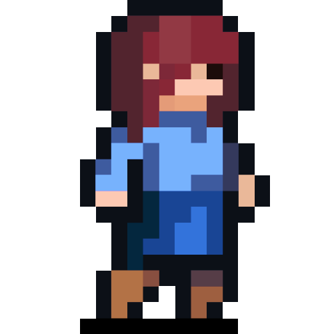
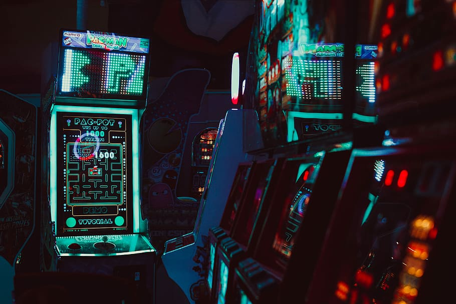

SUPSI 2022-23  
Corso d’interaction design, CV427.01  
Docenti: A. Gysin, G. Profeta  

Elaborato 2: Antologia a due mani  

# Game controller
Autore: Sofia Nunnari  


## Tema affrontato
Il progetto affronta il tema dei controller...


## Riferimenti progettuali
Per la progettazione del sito, ho deciso di utilizzare ...

[]()
[]()


## Design dell’interfraccia e modalià di interazione
Ho progettato l’interfaccia e la modalità di interazione per il sito, il codice ....


https://github.com/Sofinari/game-control-hub/assets/126773941/4733f2e6-d119-4863-b0c1-aec40e6b806e


## Tecnologia usata
La tecnologia utilizzata per la realizzazione del sito si basa su HTML, CSS, JS...


```JavaScript
function drawPacman(x, y, size, angle, flip) {
	const mouthSize = size * 0.5;

	noStroke();
	fill(255, 255, 0); // colore giallo per il corpo di Pacman

	angle = min(angle, 90);

	const a2 = radians(angle / 2)

	if (flip) {
		arc(x, y, size, size, a2, TAU - a2, PIE);
	} else {
		arc(x, y, size, size, PI + a2, PI - a2, PIE);
	}
}
```
Funzione per disegnare il pacman


```JavaScript
function keyPressed() {
	if (keyCode === 32) {
		let newPallino = new Pallino();
		pallini.push(newPallino);
	}
}
class Pallino {
	constructor() {
		this.x = random(width);
		this.y = random(height);
		this.r = 10
	}

	display() {
		fill(255);
		ellipse(this.x, this.y, this.r * 2, this.r * 2)
	}

	collide(x, y, r) {
		const distCentri = dist(x, y, this.x, this.y);
		const sommaRaggi = this.r + r; // raggio della bocca
		if (distCentri < sommaRaggi) {
			// Incrementa il punteggio e rimuovi il pallino
			punteggio++;
			return true;
		} else {
			return false;
		}
	}

}

```
Funzioni per generare i pallini + la sparizione del pallino una
volta mangiato (con l’incrementazione di un punto)


```JavaScript
async function draw() {
	background('#00095B');

	for (let i = 0; i < pallini.length; i++) {
		pallini[i].display();
	}

	// Visualizza il punteggio
	textSize(32);
	fill(255);
	text("Punteggio: " + punteggio, 10, 30);


```
Funzione per disegnare il canvas più tutte le altre sottostrutture
(conteggio dei punti, interpolazione “smooth”, ecc...)


## Target e contesto d’uso
Il target principale è costituito per gli amanti dei videogiochi, indipendentemente dall’età. Il contesto d’uso ideale per la marionetta potrebbe essere per essere utilizzata in contesti di intrattenimento interattivo, come ad esempio fiere del gioco o eventi simili. Grazie alla sua interfaccia intuitiva e alla modalità di interazione semplice ma coinvolgente, la marionetta può catturare l’attenzione del pubblico e intrattenerlo.


## Link al progetto su GitHub
<a href ="https://sofinari.github.io/fake_pacman/">https://sofinari.github.io/fake_pacman/</a>
